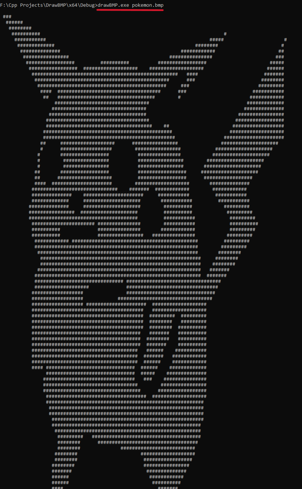
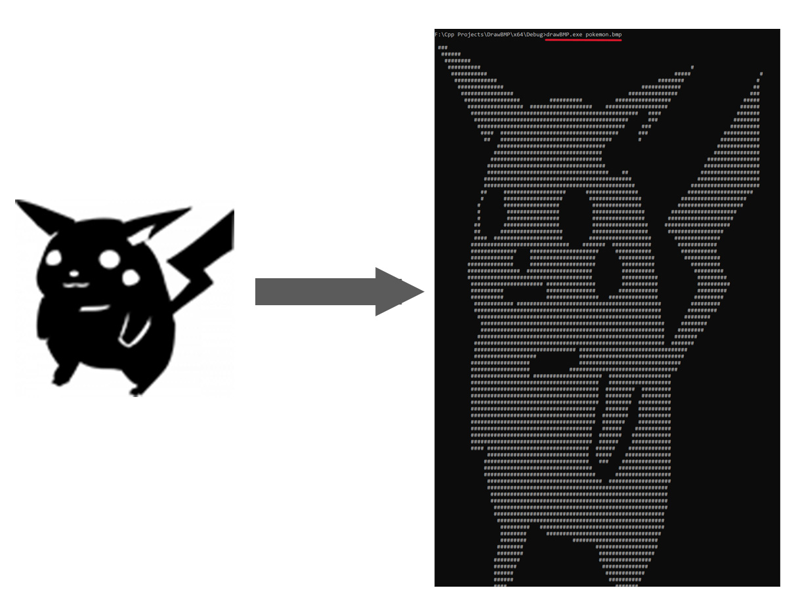

# DrawBMP

**DrawBMP** — это консольная утилита на C++ для чтения и отображения изображений BMP (24 и 32 бита) в текстовом виде в консоли. Чёрные пиксели отображаются символом `#`, белые — пробелом.

## 🔧 Возможности

- Поддержка BMP файлов с глубиной цвета 24 и 32 бита.
- Отображение изображения в консоли с помощью символов `#` и ` `.

## 📦 Требования

- Windows (используется `<windows.h>` и установка кодировки консоли).
- Компилятор C++ с поддержкой стандарта C++11 или выше.

## ⚙️ Сборка

Собрать программу можно с помощью любого C++ компилятора. Например, с использованием `g++`:

```bash
g++ -std=c++11 -o drawBMP main.cpp
```

## 🚀 Использование

```bash
drawBMP <путь_к_BMP_файлу>
```
Пример:
```bash
drawBMP pokemon.bmp
```

## 📸 Скриншоты


